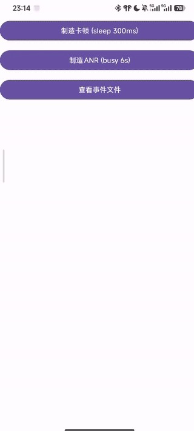

# 📊 Android Performance Monitor SDK (Demo)

> 一个 **Android 客户端性能监控 SDK（练习项目）**
> 以 **SDK 形态** 实现 **流畅性（Jank）监控** 和 **ANR 监控**，并通过 **Demo App** 完成采集 → 存储 → 展示的完整闭环。

---

## ✨ 项目背景

在真实业务中，**性能问题往往难以复现**，例如：

* 列表滑动卡顿
* 页面点击无响应
* 主线程长时间阻塞但未必触发系统 ANR 对话框

本项目以工程训练为目标，尝试从 **SDK 提供方视角** 实现一个最小可用的客户端性能监控方案，用于：

* 发现性能问题
* 产出定位线索（线程堆栈）
* 展示监控结果

---

## 🎯 项目目标

* ✅ 以 **独立 SDK 模块（Android Library）** 形式实现
* ✅ 支持 **流畅性（Jank）监控**
* ✅ 支持 **ANR（主线程无响应）监控**
* ✅ SDK 与 App 解耦，仅通过初始化接入
* ✅ 提供 Demo App 用于 **功能演示与测试**
* ✅ 架构清晰、可扩展、可解释

---

## 🧱 项目结构

```
├── app/                # Demo App（展示与测试）
│   ├── MainActivity    # 触发卡顿 / ANR
│   ├── EventListActivity
│   ├── EventDetailActivity
│
├── perfsdk/            # 性能监控 SDK（Android Library）
│   ├── PerfSDK         # SDK 对外入口（init / start / stop）
│   ├── PerfConfig      # 配置项（阈值、开关）
│   │
│   ├── jank/
│   │   └── JankMonitor # 基于 Choreographer 的流畅性监控
│   │
│   ├── anr/
│   │   └── AnrWatchdog # 主线程心跳探针（ANR 监控）
│   │
│   ├── store/
│   │   ├── PerfEvent   # 事件模型
│   │   ├── EventStore  # 异步本地落盘
│   │   └── JsonUtil
│
└── README.md
```

---

## 🚀 功能介绍

### 1️⃣ 流畅性监控（Jank Monitor）

**实现思路：**

* 基于 `Choreographer#doFrame()` 监听 UI 帧回调
* 计算两帧之间的时间间隔
* 当帧间隔超过阈值（默认 100ms）时，认为发生明显卡顿
* 记录：

  * 卡顿持续时间
  * 丢帧数量
  * 卡顿发生时的主线程堆栈

**特点：**

* 仅在触发时抓取堆栈，避免监控本身引入额外性能开销
* 适合定位主线程阻塞导致的 UI 卡顿问题

---

### 2️⃣ ANR 监控（Watchdog）

**实现思路：**

* 使用子线程定时向主线程投递“心跳任务”
* 若主线程在设定阈值内（默认 5s）未执行心跳任务，则认为发生“疑似 ANR”
* 记录：

  * 无响应持续时间
  * 主线程堆栈信息

**说明：**

* 系统级 ANR 由 AMS 触发，SDK 无法完全等价复现
* Watchdog 是工程实践中**稳定、常见**的客户端 ANR 监控方案

---

### 3️⃣ 数据存储与展示

* 所有事件以 **JSON Lines** 格式异步写入本地文件
* Demo App 负责解析并展示监控结果
* 支持：

  * 事件列表（卡片化展示）
  * 事件详情（完整堆栈）
  * 简单汇总统计（次数 / 最严重事件）

---

### 4️⃣ Demo App 演示功能

* **制造卡顿**：主线程 `sleep`
* **制造 ANR**：主线程 busy loop
* **实时 Toast 提示**：事件发生即反馈
* **事件列表页**：直观展示监控结果

---

## 🖥️ 演示效果（示意）

* 实时提示
  
* 列表展示
  
---

## 🔧 SDK 接入方式（示例）

```java
// Application / Activity 中初始化
PerfSDK.init(getApplicationContext(), PerfConfig.defaultConfig());
PerfSDK.start();
```

---

## 🧠 架构设计与取舍说明

* **SDK 与业务解耦**：以 Android Library 形式存在
* **监控开销控制**：

  * 堆栈仅在触发事件时采集
  * 文件 IO 使用单线程异步写入
* **可扩展性**：

  * 统一事件模型
  * 配置项集中管理
  * 可扩展上报、采样、过滤策略

---

## ⚠️ 已知限制

* 当前仅支持主线程卡顿与 ANR 的基础监控
* 系统级 ANR（AMS / SIGQUIT）行为在不同 ROM 上存在差异
* 本项目以工程训练与演示为目的，未覆盖复杂生产场景

---

## 📌 后续可扩展方向

* SIGQUIT 信号捕获（NDK）对齐系统 ANR 路径
* FrameMetrics（API 24+）获取更细粒度绘制耗时
* 事件采样与降级策略
* 网络上报与后台聚合分析
* 多进程 / 冷启动性能监控

---

## 🎥 演示视频

本项目提供 Demo App 用于直观展示 SDK 的监控能力。

### 快速预览


### 完整演示视频
👉 [点击观看完整演示视频](docs/demo.mp4)


---

## 🧑‍💻 作者说明

本项目为 **学习项目**，旨在从 SDK 提供方视角理解：

* 客户端性能监控的基本原理
* 工程实现中的取舍与边界
* 如何将“性能问题”转化为“可定位的信息”

---
